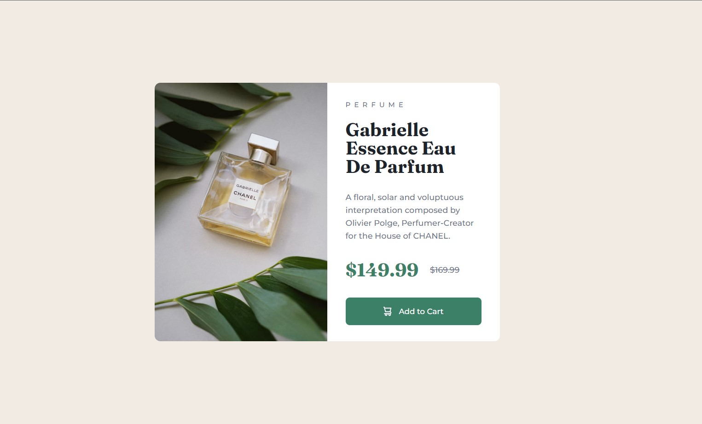
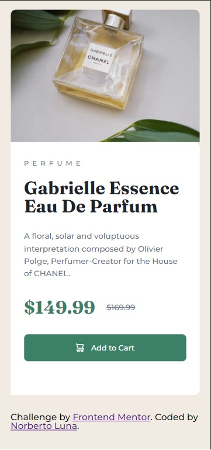

# Frontend Mentor - Product preview card component solution

This is a solution to the [Product preview card component challenge on Frontend Mentor](https://www.frontendmentor.io/challenges/product-preview-card-component-GO7UmttRfa).

## Table of contents

- [Overview](#overview)
  - [The challenge](#the-challenge)
  - [Screenshot](#screenshot)
  - [Links](#links)
- [My process](#my-process)
  - [Built with](#built-with)
  - [What I learned](#what-i-learned)
  - [Continued development](#continued-development)
  - [Useful resources](#useful-resources)
- [Author](#author)
- [Acknowledgments](#acknowledgments)

## Overview

### The challenge

Users should be able to:

- View the optimal layout depending on their device's screen size
- See hover and focus states for interactive elements

### Screenshot




### Links

- Solution URL: [Add solution URL here](https://github.com/Grathienbeto/product-preview-card-component)
- Live Site URL: [Add live site URL here](https://grathienbeto.github.io/product-preview-card-component/)

## My process

### Built with

- Semantic HTML5 markup
- CSS custom properties
- Sass

### What I learned

Added Sass as a new tecnology over the last challenge. Felt a lot more comfortable working with Sass than with plain CSS, mainly because of partials.

```CSS
.container {
  height: 100vh;
  display: flex;
  justify-content: center;
  align-items: center;
}
```

This snippet to make the card stay in the middle.

### Continued development

Next challenges i'll try to incorporate Tailwind or Bootstrap.

### Useful resources

- [Sass Basics](https://sass-lang.com/guide/) - Sass basics page.

## Author

- Frontend Mentor - [@Grathienbeto](https://www.frontendmentor.io/profile/Grathienbeto)
- Twitter - [@betoluna89](https://twitter.com/betoluna89)
